
<h1 align="center">武理多媒体信息共享平台开发</h1>

## 简介
武理多媒体信息共享平台：角色分为管理员、用户；提供用户注册、作品信息管理、私信互动、公告发布、密码找回及多种媒体内容上传浏览功能    --计算机毕业设计源码；毕设源码；java毕业设计源码

## 联系方式

<h3 align="center">获取完整代码与数据库文件 + 微信：deepguan QQ: 86050149 QQ群: 783742310</h3>

<h3 align="center">可帮忙远程部署 包运行成功！提供远程部署、修改代码、设计文档指导、代码讲解等服务！</h3>

## 功能介绍（完整见运行截图）
管理员：登录、注册、退出等基本功能。可以通过后台管理界面管理用户和作品信息，包括审核、修改和删除作品。导航栏提供的模块有首页、作品信息、公告信息，以及个人中心。个人中心内可查看和编辑个人信息，同时具有作品分类管理、作品信息管理、用户管理、私聊信息管理等权限。支持查看网站公告以及在富文本编辑器中进行内容创作和发布。

用户：可进行登录、注册和退出操作。通过前台界面可以浏览首页内容，包括作品信息、公告信息、和提供个人中心模块。用户能上传和分享自己的多媒体作品，设置作品信息如名称、分类、类别、封面等，并能与他人进行互评和私聊交流。用户可在个人中心管理个人信息，查看上传的作品细节，参加讨论以及查看学校的公告和活动信息。

## 运行截图
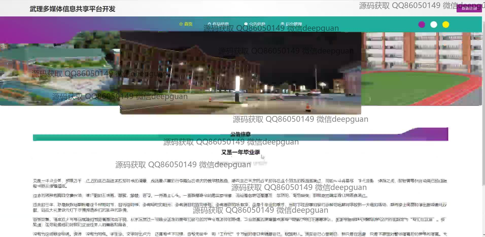

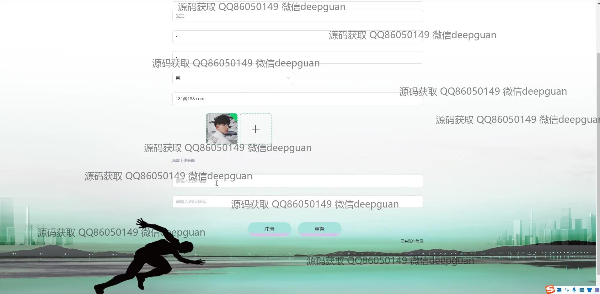
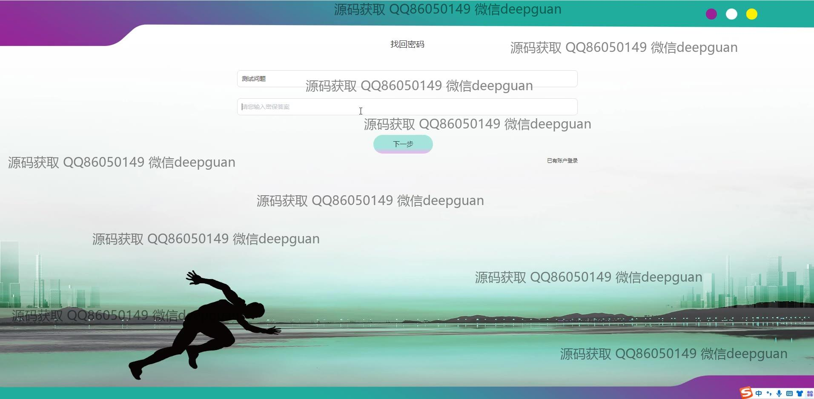
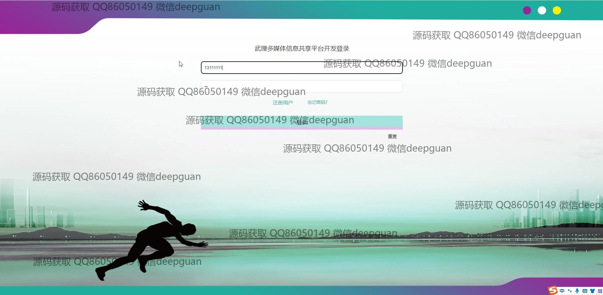
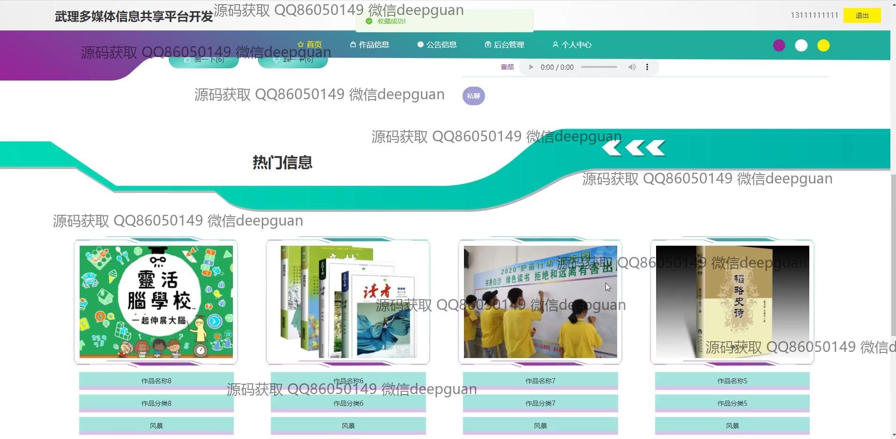

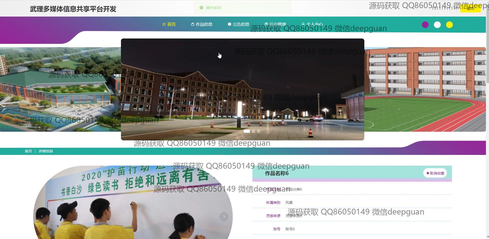
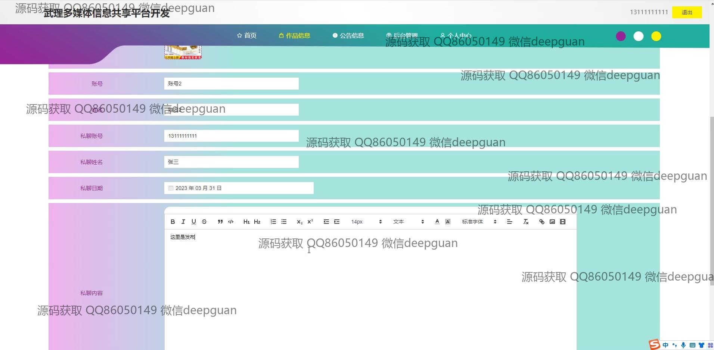
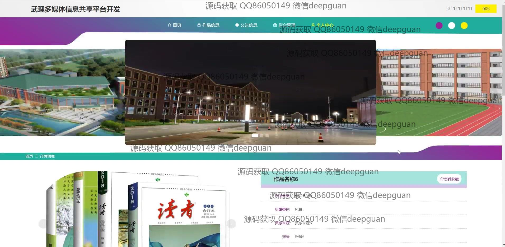
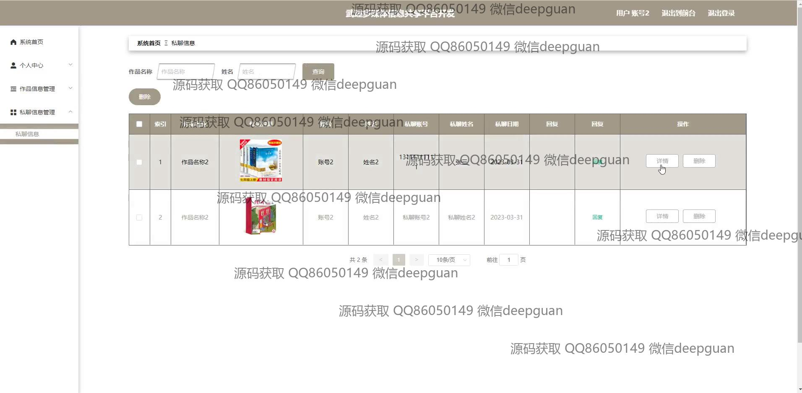
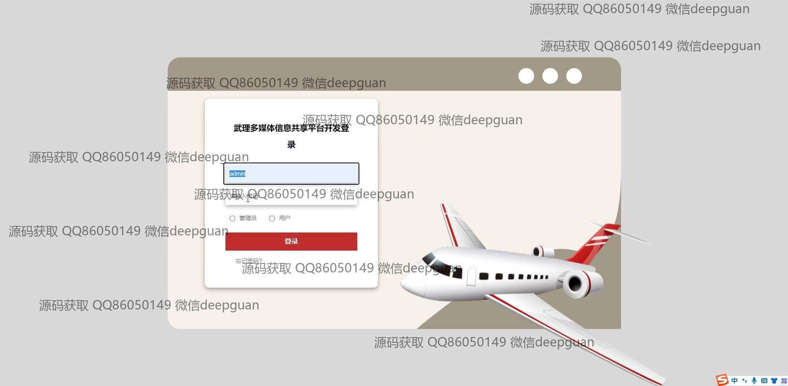
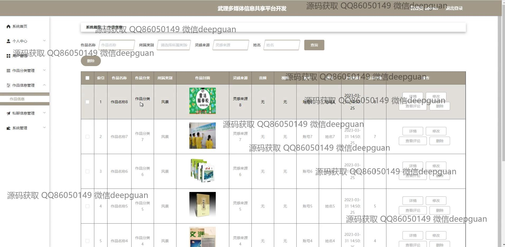
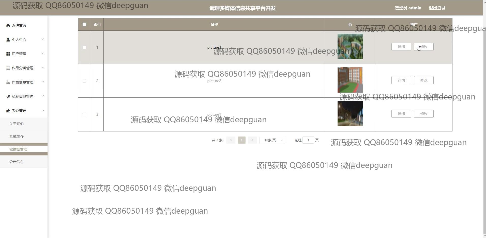
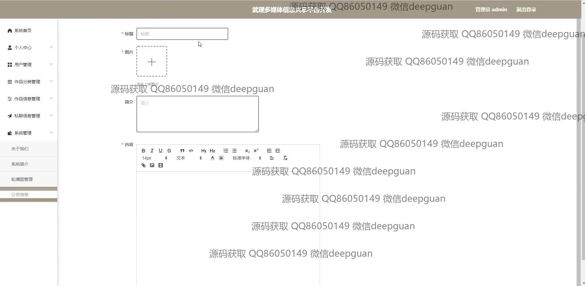
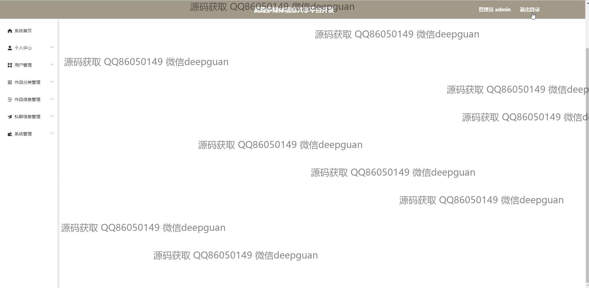
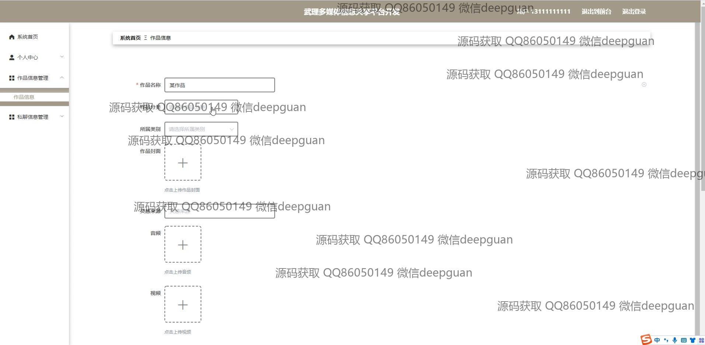
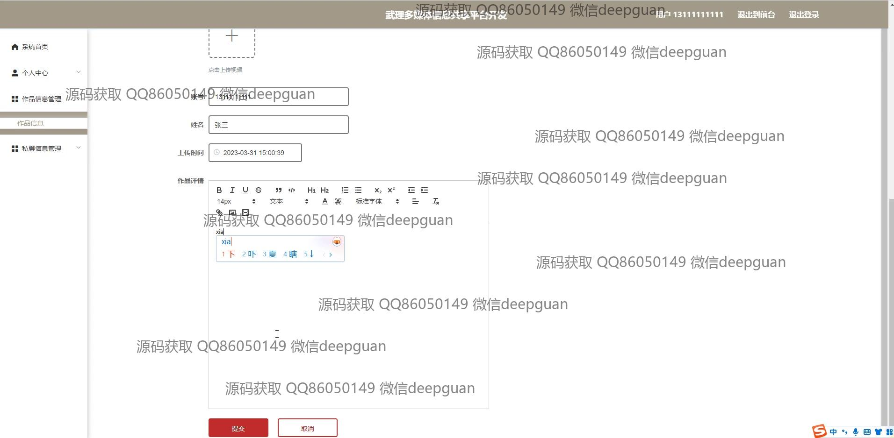

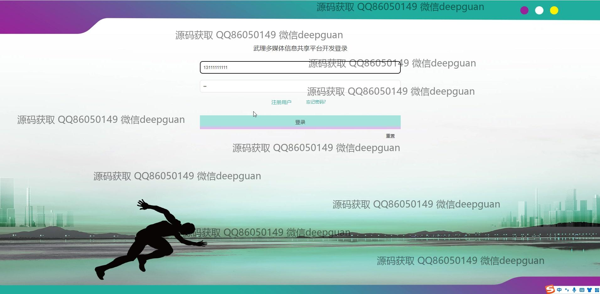
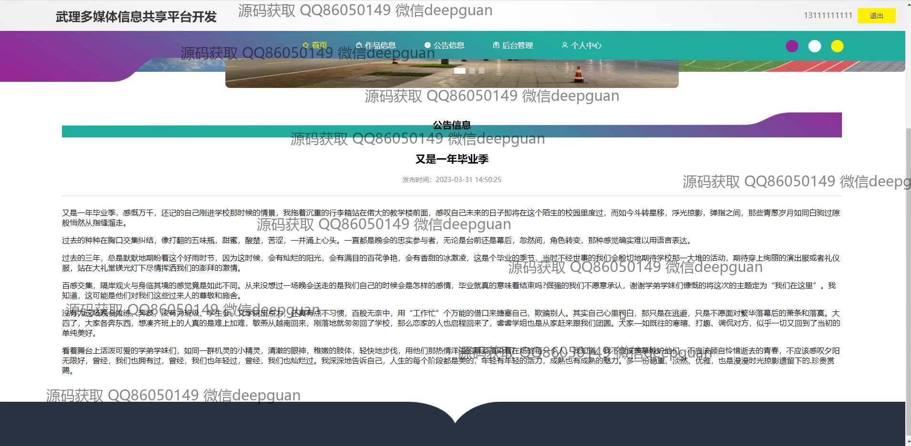
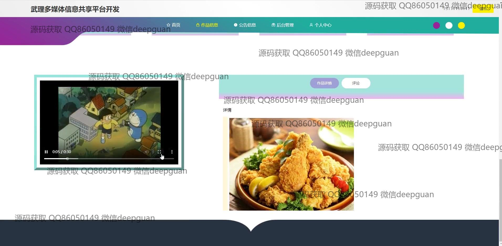

本代码来源于网络,仅供学习参考使用!

